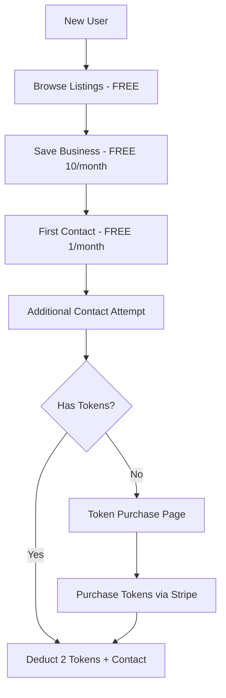
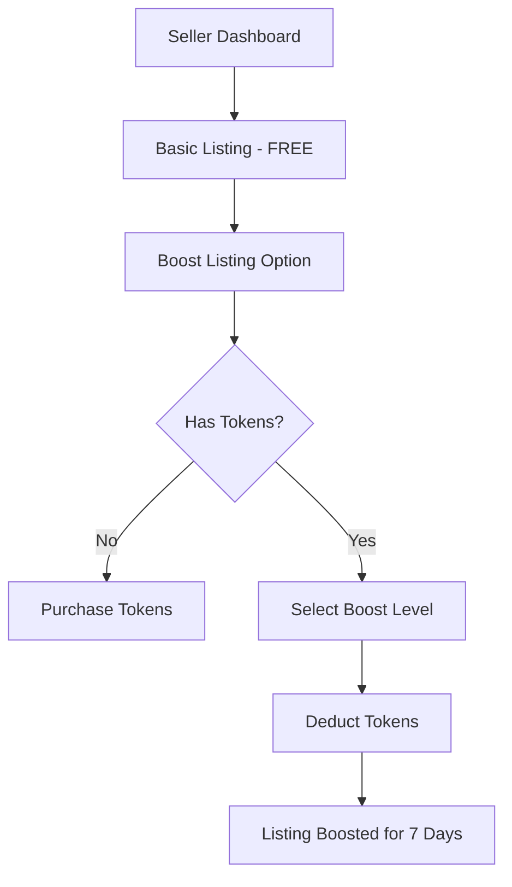

# Freemium Token-Based System PRD
## Product Requirements Document for Arzani Marketplace

### Executive Summary

This PRD outlines the implementation of a freemium token-based system for the Arzani marketplace, transforming it from a traditional free-access model to a hybrid SaaS/marketplace with token-gated premium features. The system will introduce controlled access to listings through token consumption while maintaining scalability and user experience.

---

## 1. Product Vision & Objectives

### Vision
Transform Arzani into a scalable freemium marketplace where buyers purchase tokens for premium interactions and sellers use tokens for enhanced listing visibility and analytics.

### Core Objectives
- **Revenue Diversification**: Create sustainable revenue streams through token sales
- **User Engagement Control**: Limit spam and low-quality interactions through token requirements
- **Seller Value Addition**: Provide premium marketing tools and analytics for sellers
- **Scalable Growth**: Support thousands of microtransactions efficiently

---

## 2. Current State Analysis

### Existing Database Structure
```sql
-- Current user system supports:
users.buyer_plan (free/premium)
users.subscription_type (free/premium)
users.stripe_customer_id
saved_businesses (unlimited saves)
business_inquiries (unlimited contacts)
ai_credits (30 credits/week limit)
```

### Current Pain Points
- Unlimited free browsing leads to low conversion
- No restrictions on seller contacts (spam potential)
- No premium seller features for listing promotion
- Basic subscription model lacks granular control

---

## 3. Token Economy Design

### Token Value Proposition
- **£10 = 10 tokens** (£1 per token standard rate)
- **Volume discounts**: £25 = 30 tokens, £50 = 65 tokens
- **Promotional rates**: First-time buyers get 20% bonus tokens

### Token Consumption Model

#### For Buyers (Contact/Interaction Tokens)
| Action | Token Cost | Freemium Limit |
|--------|------------|----------------|
| Browse listings | Free | Unlimited |
| Save businesses | Free | 10 per month |
| Contact seller (first time) | 2 tokens | 1 per month |
| Additional contacts (same business) | 1 token | N/A |
| Premium business details access | 1 token | N/A |
| AI valuation report | 3 tokens | N/A |
| Schedule viewing | 2 tokens | N/A |

#### For Sellers (Promotion/Analytics Tokens)
| Feature | Token Cost | Duration/Scope |
|---------|------------|----------------|
| Boost listing (top 10) | 5 tokens | 7 days |
| Featured badge | 10 tokens | 30 days |
| Premium analytics dashboard | 3 tokens | 30 days access |
| AI-generated listing optimization | 5 tokens | One-time analysis |
| Priority customer support | 2 tokens | Per ticket |

---

## 4. Implementation Architecture

### Database Schema Design

#### New Tables Required
```sql
-- User token wallet
CREATE TABLE user_tokens (
    id SERIAL PRIMARY KEY,
    user_id INTEGER REFERENCES users(id),
    token_balance INTEGER DEFAULT 0,
    tokens_purchased INTEGER DEFAULT 0,
    tokens_consumed INTEGER DEFAULT 0,
    created_at TIMESTAMP DEFAULT CURRENT_TIMESTAMP,
    updated_at TIMESTAMP DEFAULT CURRENT_TIMESTAMP
);

-- Token transactions log
CREATE TABLE token_transactions (
    id SERIAL PRIMARY KEY,
    user_id INTEGER REFERENCES users(id),
    transaction_type VARCHAR(50), -- 'purchase', 'consumption', 'refund'
    tokens_amount INTEGER,
    action_type VARCHAR(100), -- 'contact_seller', 'boost_listing', etc.
    reference_id INTEGER, -- business_id or other reference
    stripe_payment_intent_id VARCHAR(255),
    created_at TIMESTAMP DEFAULT CURRENT_TIMESTAMP,
    metadata JSONB DEFAULT '{}'
);

-- Contact limitations tracking
CREATE TABLE contact_limitations (
    id SERIAL PRIMARY KEY,
    user_id INTEGER REFERENCES users(id),
    business_id INTEGER REFERENCES businesses(id),
    contact_count INTEGER DEFAULT 0,
    first_contact_at TIMESTAMP,
    last_contact_at TIMESTAMP,
    tokens_spent INTEGER DEFAULT 0,
    UNIQUE(user_id, business_id)
);

-- Token packages/pricing
CREATE TABLE token_packages (
    id SERIAL PRIMARY KEY,
    name VARCHAR(100),
    token_amount INTEGER,
    price_gbp INTEGER, -- in pence
    bonus_tokens INTEGER DEFAULT 0,
    stripe_price_id VARCHAR(255),
    is_active BOOLEAN DEFAULT true,
    created_at TIMESTAMP DEFAULT CURRENT_TIMESTAMP
);
```

#### Modified Existing Tables
```sql
-- Add token-related fields to users table
ALTER TABLE users ADD COLUMN token_balance INTEGER DEFAULT 0;
ALTER TABLE users ADD COLUMN free_contacts_used INTEGER DEFAULT 0;
ALTER TABLE users ADD COLUMN free_contacts_reset_date TIMESTAMP DEFAULT CURRENT_TIMESTAMP;

-- Add premium features to businesses table
ALTER TABLE businesses ADD COLUMN is_boosted BOOLEAN DEFAULT false;
ALTER TABLE businesses ADD COLUMN boosted_until TIMESTAMP;
ALTER TABLE businesses ADD COLUMN boost_level INTEGER DEFAULT 0; -- 0=none, 1=standard, 2=premium

-- Extend business_inquiries for token tracking
ALTER TABLE business_inquiries ADD COLUMN tokens_spent INTEGER DEFAULT 0;
ALTER TABLE business_inquiries ADD COLUMN inquiry_type VARCHAR(50) DEFAULT 'free'; -- 'free', 'token'
```

---

## 5. Stripe Integration Architecture

### Payment Products Structure
```javascript
// Stripe Product Configuration
const tokenPackages = [
  {
    name: "Starter Pack",
    tokens: 10,
    price: 1000, // £10.00 in pence
    priceId: "price_starter_tokens",
    recommended: false
  },
  {
    name: "Professional Pack", 
    tokens: 30,
    price: 2500, // £25.00 in pence (16% discount)
    priceId: "price_professional_tokens",
    recommended: true
  },
  {
    name: "Enterprise Pack",
    tokens: 65,
    price: 5000, // £50.00 in pence (23% discount)
    priceId: "price_enterprice_tokens", 
    recommended: false
  }
];
```

### Payment Flow Design
1. **Token Purchase Flow**
   - User selects token package
   - Stripe Checkout Session created
   - Payment processed via Stripe
   - Webhook updates user token balance
   - Transaction logged in token_transactions

2. **Token Consumption Flow**
   - Action requires token validation
   - Check user token balance
   - Deduct tokens if sufficient
   - Log consumption transaction
   - Execute protected action

---

## 6. User Experience Flow

### Freemium User Journey


### Seller Token Usage


---

## 7. Anti-Abuse & Fraud Prevention

### Freemium Limits Enforcement
- **IP-based tracking** for anonymous users
- **Device fingerprinting** to prevent multi-account abuse
- **Email verification** required for free contacts
- **Phone verification** for high-value interactions

### Token System Security
- **Server-side validation** for all token transactions
- **Idempotency keys** to prevent double-spending
- **Real-time balance checking** before action execution
- **Audit trail** for all token movements

---

## 8. Analytics & Monitoring

### Key Performance Indicators (KPIs)
- **Token Purchase Conversion Rate**: % of users who buy tokens
- **Token Utilization Rate**: Consumed vs purchased tokens
- **Average Revenue Per User (ARPU)**: Monthly token revenue per active user
- **Freemium to Premium Conversion**: % upgrading from free limits
- **Contact Quality Score**: Success rate of token-based contacts vs free

### Business Intelligence Dashboard
```sql
-- Sample analytics queries
-- Token economy health
SELECT 
    DATE_TRUNC('month', created_at) as month,
    COUNT(*) as purchases,
    SUM(tokens_amount) as tokens_sold,
    AVG(tokens_amount) as avg_purchase_size
FROM token_transactions 
WHERE transaction_type = 'purchase'
GROUP BY month;

-- User behavior patterns
SELECT 
    u.buyer_plan,
    AVG(ut.token_balance) as avg_balance,
    AVG(ut.tokens_consumed) as avg_consumed,
    COUNT(DISTINCT u.id) as user_count
FROM users u
JOIN user_tokens ut ON u.id = ut.user_id
GROUP BY u.buyer_plan;
```

---

## 9. Migration Strategy

### Phase 1: Foundation (Weeks 1-2)
- Create new database tables
- Set up Stripe token products
- Build basic token purchase flow
- Implement token balance tracking

### Phase 2: Core Features (Weeks 3-4)
- Implement contact limitations for freemium users
- Add token consumption for seller contacts
- Create seller token features (boost, analytics)
- Build admin dashboard for token management

### Phase 3: Enhancement (Weeks 5-6)
- Add advanced seller features
- Implement anti-abuse measures
- Create comprehensive analytics
- User onboarding and education

### Phase 4: Optimization (Weeks 7-8)
- A/B test token pricing
- Optimize conversion funnels
- Performance monitoring and scaling
- User feedback integration

---

## 10. Technical Specifications

### API Endpoints
```javascript
// Token management endpoints
POST /api/tokens/purchase          // Create Stripe checkout session
GET  /api/tokens/balance           // Get user token balance
POST /api/tokens/consume           // Consume tokens for action
GET  /api/tokens/transactions      // Get user transaction history

// Enhanced business interaction endpoints  
POST /api/businesses/:id/contact   // Contact seller (token-gated)
POST /api/businesses/:id/boost     // Boost listing (sellers)
GET  /api/businesses/premium/:id   // Premium business details
```

### Performance Requirements
- **Token balance queries**: < 50ms response time
- **Payment processing**: < 3 second completion
- **Token consumption**: < 100ms validation
- **Concurrent users**: Support 1000+ simultaneous token operations

---

## 11. Success Metrics

### Financial Targets (Year 1)
- **Monthly Recurring Revenue**: £50,000+ from token sales
- **Average Customer Value**: £25/month per active token user
- **Token Economy Growth**: 25% month-over-month token sales increase

### User Experience Metrics
- **Freemium Conversion**: >15% of free users purchase tokens within 30 days
- **Token Utilization**: >80% of purchased tokens used within 3 months
- **User Satisfaction**: >4.5/5 rating for token-based features

### Operational Excellence
- **System Uptime**: >99.9% for token-related services
- **Payment Success Rate**: >95% for token purchases
- **Support Ticket Volume**: <2% increase despite new complexity

---

## 12. Risk Assessment & Mitigation

### Technical Risks
- **Risk**: Stripe webhook failures causing token balance inconsistencies
- **Mitigation**: Implement idempotent webhook processing and daily reconciliation

### Business Risks  
- **Risk**: User backlash against token restrictions
- **Mitigation**: Gradual rollout with generous freemium limits and clear value proposition

### Market Risks
- **Risk**: Competitors offering unlimited free access
- **Mitigation**: Focus on quality over quantity, premium seller features, AI-powered matching

---

## 13. Appendices

### A. Competitive Analysis
| Platform | Free Model | Paid Model | Token System |
|----------|------------|------------|--------------|
| Tinder | Limited swipes | Unlimited + boosts | Yes (Super Likes) |
| LinkedIn | Limited connections | Premium features | No |
| Rightmove | Full browsing | Premium listings | No |
| BizBuySell | Limited details | Full access | No |

### B. Legal Considerations
- GDPR compliance for token transaction data
- Clear terms of service for token purchases and consumption
- Refund policy for unused tokens
- Age verification for token purchases

### C. Customer Support Preparation
- Token balance inquiry procedures
- Payment failure resolution steps
- Refund processing guidelines
- User education materials for token system

---

**Document Version**: 1.0  
**Last Updated**: January 2025  
**Next Review**: February 2025  
**Stakeholders**: Product, Engineering, Finance, Legal, Customer Success
